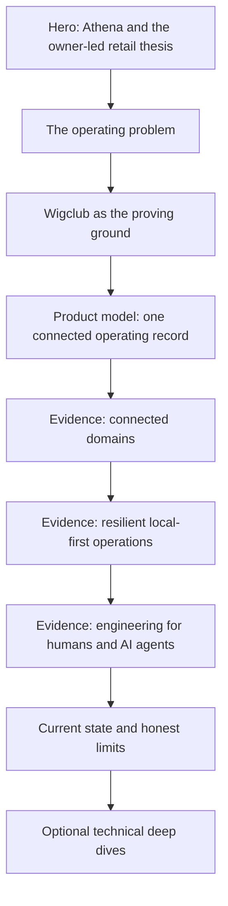
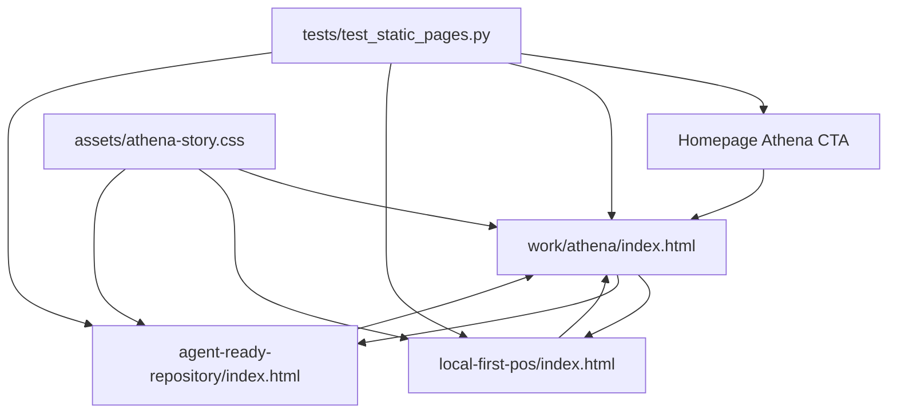

# Athena Product Story - Plan

## Goal Capsule

- **Objective:** Create a dedicated Athena space that shows how Kwamina turns a messy retail operating problem into a coherent, production-minded software system.
- **Authority hierarchy:** This plan governs page structure and public claims; the Athena repository governs technical truth; the existing homepage governs the site's visual language.
- **Open blockers:** None for the text-and-diagram-first development scope; publication-safe interface captures remain deferred.
- **Stop conditions:** Stop if implementation requires publishing an unaudited Athena capture, inventing customer outcomes, or broadening the approved page family.
- **Execution profile:** Static HTML/CSS content work with dependency-free structural tests and browser verification.
- **Tail ownership:** Keep the implementation local; do not push or open a pull request.

---

## Product Contract

### Summary

The Athena space will use a story-and-evidence-spine layout to present a complete product narrative supported by operating and engineering proof.
The main page will stand alone, while two optional deep dives will explain the local-first point of sale and the agent-ready repository.

### Problem Frame

Athena needs to read as more than a project gallery entry or a technical architecture document.
The page should help a hiring reader understand the operating problem, see how product decisions follow from it, and trust the engineering choices that make the system credible.

The story begins with an owner-led retail reality: sales, stock, procurement, cash, services, and staff activity create one operating day, but disconnected tools leave the owner to reconstruct it.
Wigclub gives that problem a real proving context, but the page must not frame one business as the limit of Athena's ambition.

### Key Decisions

- **Story and evidence spine:** An authored main narrative will carry the product story while a compact context rail and structured evidence blocks support scanning.
- **Product problem first:** The operating problem will precede the product model, architecture, and AI-agent development method so the technical evidence has a clear reason to exist.
- **Broad problem before proving ground:** The page will establish the owner-led retail problem before naming Wigclub as the context in which the problem became concrete.
- **Self-contained main page:** Readers will not need to open a deep page to understand Athena's problem, thesis, proof, current state, or Kwamina's contribution.
- **Safe evidence first:** The initial version will use source-derived diagrams and one code-native, nonnumeric Store Pulse illustration; captured product media may be added only after asset approval.
- **Explicit authorship:** The page will state Kwamina's role as “Product direction, design, and engineering.” AI agents will be described separately as the development method.
- **Honest current state:** The closing section will distinguish what works, what is being validated, and what Athena does not yet claim.
- **Two initial deep dives:** The first technical essays will cover the local-first point of sale and the agent-ready repository.

### Readers

- A1. A hiring reader needs to understand the product judgment and production-minded engineering without reading every technical detail.
- A2. A technical peer or collaborator needs enough concrete evidence to trust the architecture and AI-assisted development claims.

### Information Architecture

- `/work/athena` — complete product story
- `/work/athena/local-first-pos` — technical reflection on offline continuity, local evidence, and safe reconciliation
- `/work/athena/agent-ready-repository` — technical reflection on maps, documentation, tests, review gates, and runtime feedback for human and AI contributors

### Main Page Structure

The desktop narrative will pair with a compact context rail containing section navigation, role, method, project status, and deep-page links.
On narrow screens, that context will become an inline block beneath the opening rather than a persistent rail.

### Requirements

**Narrative and positioning**

- R1. The main page must lead with Athena's owner-led retail operating problem rather than its architecture or AI-agent development method.
- R2. The page must identify Athena as “A business operating system for owner-led retail.”
- R3. The page must introduce Wigclub only after establishing the broader problem and must frame it as a proving ground rather than the product's ceiling.
- R4. The complete page must support the conclusion that Kwamina can turn a messy business problem into a coherent, production-minded software system.
- R5. The page must remain understandable without requiring readers to open either technical deep dive.

**Structure and layout**

- R6. The main page must use an authored narrative as its primary reading path and structured evidence blocks as its secondary scanning path.
- R7. The desktop layout must include a compact context rail with navigation, role, method, status, and deeper-reading links.
- R8. The mobile layout must move the rail's context inline without losing any of its information.
- R9. The page must identify Kwamina's role as “Product direction, design, and engineering.”
- R10. The page must identify the method as “Built with AI agents” and the status as “Active development,” without presenting agents as Athena's customer-facing promise or an independent author.

**Evidence and claims**

- R11. The initial evidence model must use explanatory diagrams and one code-native, nonnumeric Store Pulse illustration; captured product media may appear only after public-safety review.
- R12. The page must not publish current Athena screenshots until account, customer, product, and operational data have been removed and the resulting asset has passed a public-safety review.
- R13. The product model may state that Athena connects sales, inventory, procurement, cash, services, and staff activity within one operating system or operating record.
- R14. The product model must not claim that every domain is already unified into a complete cross-domain command center.
- R15. The local-first evidence may state that a provisioned, locally authorized register records its local event before success, continues selling offline, and uploads idempotently when synchronization becomes available.
- R16. The agent-ready evidence may cite generated maps, structured documentation, tests, behavior scenarios, review gates, and runtime feedback as safeguards for human and AI contribution.
- R17. The page must not claim revenue lift, time savings, adoption, growth, or other customer outcomes because no validated customer-outcome metrics are available for the portfolio yet.

**Current state and deeper reading**

- R18. Near its close, immediately before deeper-reading links, the main page must present a concise account of what works, what is being validated, and what is not yet claimed.
- R19. The initial Athena space must include deep-page paths for the local-first point of sale and the agent-ready repository.
- R20. Each deep page must expand a technical decision without repeating the main page's complete product narrative.
- R21. Every public technical claim must be mapped in a thin site-local evidence ledger to its authoritative Athena source, limitation, and review state.
- R22. Every evidence diagram must include a visible caption and an adjacent structured text equivalent that preserves its relationships for nonvisual readers.
- R23. The three unaudited Athena captures must be removed from the publishable site tree before the Athena pages are considered complete.
- R24. The main page must end with an understated email contact path after the technical deep links; the unresolved resume destination remains outside this page's scope.

### Key Reading Flow

- F1. Complete Athena story
  - **Trigger:** A reader follows the Athena link from the homepage.
  - **Actors:** A1, A2
  - **Steps:** The reader encounters the operating problem, sees Wigclub as evidence of that problem, understands Athena's product model, evaluates operating and engineering proof, and reaches a candid current-state account.
  - **Outcome:** The reader can explain why Athena exists, how the system responds to the problem, and what Kwamina personally contributed.
  - **Covered by:** R1-R18
- F2. Optional technical depth
  - **Trigger:** A reader wants more evidence about local-first continuity or AI-assisted engineering rigor.
  - **Actors:** A2
  - **Steps:** The reader follows a deep-page link from the context rail or the relevant evidence chapter.
  - **Outcome:** The reader receives technical depth without needing to reconstruct Athena's broader product story.
  - **Covered by:** R19, R20

### Acceptance Examples

- AE1. **Covers R5.** Given a reader opens only the Athena main page, when they finish the page, then they can summarize the operating problem, product thesis, three proof areas, current state, and Kwamina's role.
- AE2. **Covers R8.** Given the page is viewed on a narrow screen, when the persistent side rail is unavailable, then its navigation, role, method, status, and deep links remain available inline.
- AE3. **Covers R11, R12.** Given no publication-safe interface capture exists for a planned product moment, when the page is prepared for review, then that moment uses a diagram or deliberate placeholder rather than an unsafe screenshot.
- AE4. **Covers R13, R14.** Given the product model describes Athena's connected domains, when the copy is reviewed, then it communicates shared operating context without claiming a fully unified command center that does not yet exist.
- AE5. **Covers R15.** Given the local-first proof is summarized, when offline continuity is described, then the copy preserves the provisioned-register boundary and avoids implying that every device can sell without local authorization or integrity checks.
- AE6. **Covers R17, R18.** Given Athena has no validated customer-outcome metrics, when the current-state section is reviewed, then it states limits candidly and contains no invented performance or market claims.
- AE7. **Covers R22.** Given a diagram carries product or engineering meaning, when a nonvisual reader reaches it, then an associated structured description communicates the same nodes, order, and relationships.

### Success Criteria

- A hiring reader can identify the business problem, Athena's product thesis, and Kwamina's role without opening a deep page.
- A technical reader can locate concrete evidence for connected operations, local-first continuity, and agent-assisted engineering rigor.
- The page feels authored and product-minded rather than like product documentation, a screenshot gallery, or a generic portfolio case study.
- Every public claim and interface asset is traceable to repository evidence or a completed public-safety review.

### Scope Boundaries

- A detailed build journal or changelog is deferred.
- A separate general production-architecture deep dive is deferred until it carries a story distinct from the main page.
- Customer testimonials, logos, adoption figures, and outcome metrics are excluded until validated evidence exists.
- Final visual styling, final copy, and the production of sanitized interface assets are not resolved by this requirements plan.
- Public deployment is deferred; before publishing, use a clean output replacement and verify the three retired asset URLs return 404 or 410.

### Dependencies and Assumptions

- Publication-safe Athena interface assets must be created or approved before product screens can replace diagram-ready spaces.
- The existing Athena repository remains the authority for technical claims and product-state boundaries.
- The main page and deep pages will inherit the personal site's broader navigation and visual language without duplicating the homepage.

### Sources and Research

- Athena repo — `README.md` and `MANIFEST.md` for product scope, domain coverage, and current limitations.
- Athena repo — `docs/solutions/architecture/athena-pos-always-local-first-register-2026-05-14.md` and `docs/solutions/architecture/athena-pos-offline-sales-continuity-2026-06-04.md` for local-first guarantees and boundaries.
- Athena repo — `docs/harness.md`, `AGENTS.md`, and `graphify-out/wiki/index.md` for the agent-ready engineering system.
- Athena repo — `docs/reports/athena-landing-product-proof-audit.md`, `docs/reports/athena-landing-product-proof-manifest.md`, and `docs/reports/athena-landing-launch-review.md` for public-asset safety and claim limits.

---

## Planning Contract

### Key Technical Decisions

- **Route-backed static pages:** Implement the public information architecture as directory indexes under `docs/content/work/athena/` so local HTTP previews and eventual static hosting use the same paths.
- **One Athena stylesheet:** Add `docs/content/assets/athena-story.css` for the main story and both deep pages while leaving the homepage's inline styles intact to avoid an unrelated shell refactor.
- **Semantic HTML before scripting:** Build the context rail, story chapters, diagrams, and current-state ledger with semantic HTML and CSS; no JavaScript behavior is required for the approved reading experience.
- **Source-derived evidence:** Replace unsafe captures with accessible operating-model and engineering-flow diagrams plus a code-native Store Pulse illustration based on Athena's existing public-safe, nonnumeric pattern.
- **Dependency-free validation:** Add a Python standard-library test that parses the static pages, enforces unique IDs and expected landmarks, resolves internal links, and rejects references to the unaudited Athena PNGs.

### High-Level Technical Design

The main page uses a two-column story layout at desktop widths: a sticky context rail and a constrained narrative column.
At the existing site breakpoint, the rail becomes an inline context block before the story chapters.
Both deep pages reuse the same shell but use a single authored article column with a compact breadcrumb and page-local contents.

| Viewport | Layout contract |
|---|---|
| Above 980px | Two-column story grid with a 220-260px sticky rail and a narrative column capped near 760px |
| 621-980px | Single-column layout with the full context block immediately after the hero and before the first story chapter |
| 620px and below | Single-column compact spacing; every evidence diagram and link group collapses without horizontal scrolling |

### Assumptions

- The static host will resolve directory paths to `index.html`; local verification will run through an HTTP server rather than relying on `file://` behavior.
- A source-backed editorial draft is sufficient for this development pass; later copy editing may refine voice without changing the page contract.
- Diagram-led evidence satisfies the approved first version while publication-safe interface captures remain unavailable.
- Python 3 is available for local structural validation, as it is already used for the site's preview workflow.

### Sequencing

1. Establish the shared shell, route graph, stylesheet, and structural test.
2. Build the complete Athena main story and its context rail.
3. Add the local-first POS reflection.
4. Add the agent-ready repository reflection.
5. Run cross-page responsive, accessibility, content-safety, and navigation verification.

### Risks and Mitigations

- **Narrative duplication:** The main page and deep pages could repeat the same story. Keep the main page complete but concise; each deep page begins at its technical decision rather than retelling the product origin.
- **Technical overclaiming:** Condensed copy could erase important boundaries. Preserve the provisioned-register limit, the incomplete command-center state, and the absence of validated customer outcomes.
- **Prototype drift:** New pages could look unrelated to the homepage. Reuse its type families, spacing rhythm, color tokens, sticky navigation behavior, focus treatment, and responsive breakpoints.
- **Unsafe media:** Existing captures expose real account and operational data. Tests reject those asset references, and the initial pages use only semantic diagrams and deliberately generic evidence.
- **Evidence drift:** Public copy can outlive its source context. Keep `docs/content/work/athena/evidence.md` as a thin page-section-to-Athena-source map rather than a second product-proof authority.

---

## Implementation Units

### U1. Athena route and shared page foundation

**Goal:** Create the static page family, shared Athena visual system, internal route graph, and structural validation harness.

**Requirements:** R7, R8, R12, R19; AE2, AE3

**Dependencies:** None

**Files:**

- Modify `docs/content/homepage-draft-v1.html`
- Create `docs/content/assets/athena-story.css`
- Create `docs/content/work/athena/index.html`
- Create `docs/content/work/athena/local-first-pos/index.html`
- Create `docs/content/work/athena/agent-ready-repository/index.html`
- Create `docs/content/work/athena/evidence.md`
- Create `docs/content/tests/test_static_pages.py`
- Delete `docs/content/assets/athena-daily-operations.png`
- Delete `docs/content/assets/athena-point-of-sale.png`
- Delete `docs/content/assets/athena-procurement.png`

**Approach:** Point the homepage CTA at the new Athena route; create semantic shells with skip links, global navigation, one `main` landmark, consistent footer navigation, and correct relative links; centralize Athena-only tokens and components in one stylesheet; delete the redundant unsafe site copies while preserving their source material in the Athena repository; establish a thin evidence ledger that maps page sections and public wording to authoritative Athena sources and limitations. Any future media row must include public path, source revision, content hash, provenance, identifier/PII findings, amount-and-count provenance, metadata/profile status, embedded-string scan result, reviewer, review date, and an explicit `blocked` or `approved` decision.

**Patterns to follow:** Reuse the homepage's Newsreader and IBM Plex Sans typography, paper-and-ink palette, sticky translucent navigation, focus-visible outlines, centered content container, reduced-motion handling, and 980px/620px breakpoints.

**Test scenarios:**

- Covers AE2. Parse all four site pages and verify each contains one `h1`, sequential heading levels, one `main` landmark, unique IDs, and a skip link targeting that page's main content.
- Resolve every same-site `href` from each page and verify the destination file or directory index exists.
- Verify the homepage Athena CTA resolves to `work/athena/` and both deep pages link back to the main Athena page and homepage.
- Covers AE3. Verify `athena-daily-operations.png`, `athena-point-of-sale.png`, and `athena-procurement.png` are absent from the publishable tree and from every HTML reference.
- Enumerate raster, video, and PDF media under `docs/content`; reject Athena-related media without an approved evidence-ledger entry whose content hash matches, and verify every HTML/CSS media reference resolves to an approved public path.

**Verification:** All routes load through the local HTTP server without missing styles or broken internal links, and the dependency-free structural test passes.

### U2. Complete Athena product story

**Goal:** Build the self-contained main Athena page with the approved problem-first narrative, evidence spine, context rail, current-state account, and deep-page paths.

**Requirements:** R1-R19, R21, R22, R24; F1; AE1-AE4, AE6, AE7

**Dependencies:** U1

**Files:**

- Modify `docs/content/work/athena/index.html`
- Modify `docs/content/assets/athena-story.css`
- Modify `docs/content/work/athena/evidence.md`
- Modify `docs/content/tests/test_static_pages.py`

**Approach:** Lead with the owner-led retail problem; introduce Wigclub as the proving ground; explain the connected operating record as an operating-day flow from selling to stock movement, procurement pressure, cash and close, services and staff context, then owner evidence and action; caption it as shared operating context rather than a complete unified command center; add a generic HTML/CSS Store Pulse illustration with no performance values; support the thesis with connected-operations, local-first, and agent-ready chapters; close with a works/validating/not-claimed ledger, two explicit deep-page links, and an understated email contact action.

**Patterns to follow:** Follow the homepage Current Work section's narrative-to-proof rhythm while using the chosen story-and-evidence-spine layout from the Product Contract.

**Test scenarios:**

- Covers AE1. Verify the page exposes anchored chapters for the problem, proving ground, product model, three proof areas, current state, and deeper reading.
- Verify the context rail contains the exact role, method, status, page navigation, and both technical deep links.
- Covers AE4. Verify the product-model copy avoids a fully unified command-center claim and the current-state ledger names that limitation.
- Covers AE6. Verify the page contains no customer-outcome metrics, testimonial markup, or unsupported performance language.
- Covers AE7. Verify every evidence figure has a caption, an `aria-describedby` relationship, and an adjacent structured text description preserving its node order and relationships.
- Verify each public technical claim has a corresponding entry in `evidence.md`.
- Verify the closing email contact path uses the site's existing address and understated link treatment.

**Verification:** A reader can follow the complete Athena story without opening a deep page; desktop and narrow layouts preserve every rail item and story chapter.

### U3. Local-first POS technical reflection

**Goal:** Explain why Athena treats local evidence as the cashier command boundary and how ordered, idempotent synchronization preserves continuity without overstating offline authority.

**Requirements:** R15, R19, R20; F2; AE5

**Dependencies:** U1

**Files:**

- Modify `docs/content/work/athena/local-first-pos/index.html`
- Modify `docs/content/assets/athena-story.css`
- Modify `docs/content/work/athena/evidence.md`
- Modify `docs/content/tests/test_static_pages.py`

**Approach:** Structure the reflection around the failure of online-first assumptions, local evidence before success, one path for connected and disconnected operation, ordered cloud acceptance, reconciliation instead of rewritten history, and bounded local authority; use a cashier-to-cloud sequence diagram and an authority-boundary comparison; include a compact page-local contents block targeting every major section.

**Patterns to follow:** Use the main page's authored opening, evidence figures, source-note treatment, and candid limits section without repeating the Athena origin story.

**Test scenarios:**

- Covers AE5. Verify the page uses “provisioned, locally authorized register” and does not claim that any browser can sell offline.
- Verify the sequence diagram presents local append before cashier success and background synchronization after local evidence exists.
- Verify the page states that the POS is the offline-first workflow, last-known stock can drift, and accepted cloud projection becomes the cloud source of truth.
- Verify the page includes accessible figure titles or captions and a working link back to the main Athena story.
- Verify the page-local contents links resolve to every major technical section and every diagram has an associated structured text equivalent.

**Verification:** The reflection preserves the local/cloud authority boundaries and remains understandable without code or real operational data.

### U4. Agent-ready repository technical reflection

**Goal:** Show how repository orientation, validation, runtime evidence, review, and durable learning make AI-assisted development credible without implying autonomy or guaranteed correctness.

**Requirements:** R10, R16, R19, R20; F2

**Dependencies:** U1

**Files:**

- Modify `docs/content/work/athena/agent-ready-repository/index.html`
- Modify `docs/content/assets/athena-story.css`
- Modify `docs/content/work/athena/evidence.md`
- Modify `docs/content/tests/test_static_pages.py`

**Approach:** Build the reflection around the registry-to-maps-to-sensors-to-review loop; explain graph-first orientation, touched-surface validation, fail-closed freshness, runtime evidence, and preserved learnings; use a layered repository map and delivery-loop diagram with filenames rather than terminal screenshots; include a compact page-local contents block targeting every major section.

**Patterns to follow:** Reuse the main page's proof-row hierarchy and candid limitation treatment; keep claims grounded in the Athena harness and repository policy.

**Test scenarios:**

- Verify the page distinguishes agent-ready engineering from autonomous development and retains human review responsibility.
- Verify the evidence loop contains orientation, validation, runtime exercise, review, and preserved learning.
- Verify the page avoids claims of complete codebase understanding, exhaustive runtime coverage, full test coverage, or zero-regression delivery.
- Verify all figure labels and technical source references remain readable without color and the page links back to Athena.
- Verify the page-local contents links resolve to every major technical section and every diagram has an associated structured text equivalent.

**Verification:** The reflection makes the engineering method concrete while preserving the harness's documented limits.

### U5. Cross-page responsive and accessibility hardening

**Goal:** Verify and polish the complete page family as one coherent, keyboard-accessible static experience.

**Requirements:** R7, R8, R11, R12, R19, R20; AE1-AE3

**Dependencies:** U2, U3, U4

**Files:**

- Modify `docs/content/assets/athena-story.css`
- Modify `docs/content/work/athena/index.html`
- Modify `docs/content/work/athena/local-first-pos/index.html`
- Modify `docs/content/work/athena/agent-ready-repository/index.html`
- Modify `docs/content/work/athena/evidence.md`
- Modify `docs/content/tests/test_static_pages.py`

**Approach:** Check the route family at desktop, tablet, and mobile widths; keep section anchors clear of the sticky header; ensure the context rail becomes inline; confirm keyboard focus, landmark order, diagram captions, line length, and footer transitions; repair only issues within the approved Athena scope.

**Execution note:** This is primarily static layout and content integration, so use structural tests plus browser/runtime evidence rather than introducing a browser-test framework.

**Test scenarios:**

- Covers AE2. At narrow widths, verify the context block is non-sticky, single-column, and retains role, method, status, navigation, and deep links.
- Verify desktop section links land below the sticky header and the rail does not overlap the footer.
- Traverse all interactive elements by keyboard and verify visible focus, logical order, descriptive link text, and no focus traps.
- Verify each tested viewport has no horizontal overflow and all diagrams collapse without clipped labels.
- Verify one `h1` per page, `h2` for every page-navigation target or major section, and `h3` only beneath an owning `h2`.
- Verify the browser console reports no missing assets, invalid paths, or runtime errors on all four pages.

**Verification:** Structural tests pass and browser inspection confirms a coherent, accessible experience across the three Athena routes and the homepage entry point.

---

## Verification Contract

### Automated checks

- Run `python3 -m unittest discover -s docs/content/tests -p 'test_*.py'` and require a zero exit code.
- The test suite must cover HTML parse sanity, unique IDs, heading order, landmarks, route and anchor resolution, Athena page structure, diagram descriptions, claim-boundary phrases, evidence-manifest coverage, and unsafe-asset exclusion.

### Browser checks

- Serve `docs/content` over a local HTTP server and inspect the homepage plus all three Athena routes.
- Verify desktop, tablet, and mobile layouts, including the sticky-to-inline context transition and absence of horizontal overflow.
- Verify keyboard traversal, focus visibility, anchor offsets, deep-page navigation, and browser-console cleanliness.

### Content-safety checks

- No published HTML may reference the current `athena-*.png` captures.
- The current unaudited `athena-*.png` captures must not remain inside `docs/content`.
- Future Athena media must have an approved ledger row whose recorded hash matches the published file.
- No page may claim validated customer outcomes, a complete cross-domain command center, unrestricted offline authority, autonomous development, or guaranteed correctness.

---

## Definition of Done

- The homepage Athena CTA opens the complete Athena story at `work/athena/`.
- The main page follows the approved story-and-evidence-spine structure and remains complete without deep-page navigation.
- The context rail contains role, method, status, page navigation, and both deep-page links on desktop and as inline content on mobile.
- The local-first POS and agent-ready repository reflections exist, are source-backed, and do not repeat the full product narrative.
- The main page ends with a working email contact path after its technical deep links.
- All evidence is semantic, generic, and publication-safe; unaudited Athena screenshots are not referenced.
- The dependency-free structural test and every browser verification gate pass.
- Internal links, headings, landmarks, keyboard focus, and responsive layouts work across all four entry points.
- Dead-end, experimental, or superseded markup and styles are removed from the final local diff.
- U1 is complete when the route family, stylesheet, homepage link, and structural harness exist and pass.
- U2 is complete when the main story, evidence spine, context rail, current state, and deep links satisfy the Product Contract.
- U3 is complete when the local-first reflection preserves the verified authority and synchronization boundaries.
- U4 is complete when the agent-ready reflection explains the evidence loop without autonomy or correctness overclaims.
- U5 is complete when cross-page browser inspection and structural validation are green.
