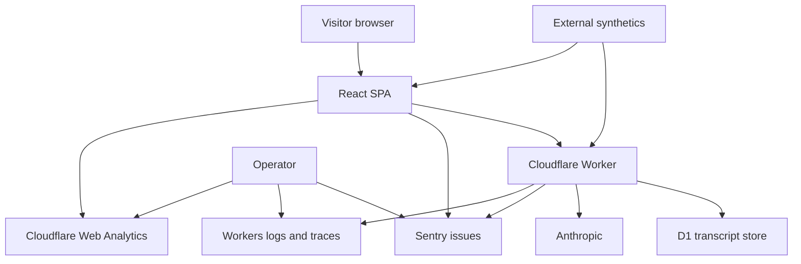
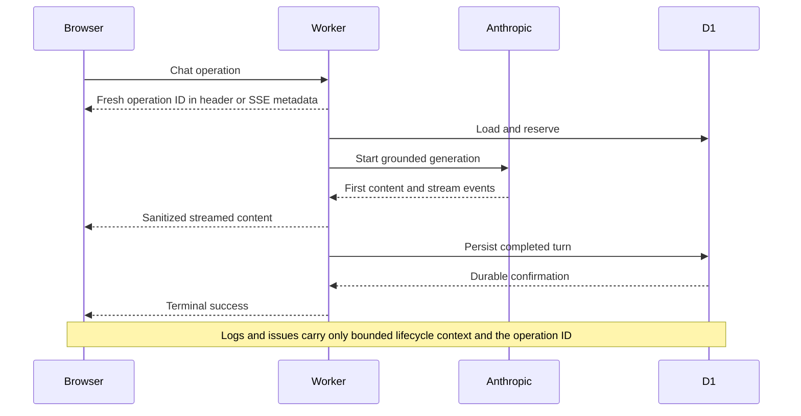
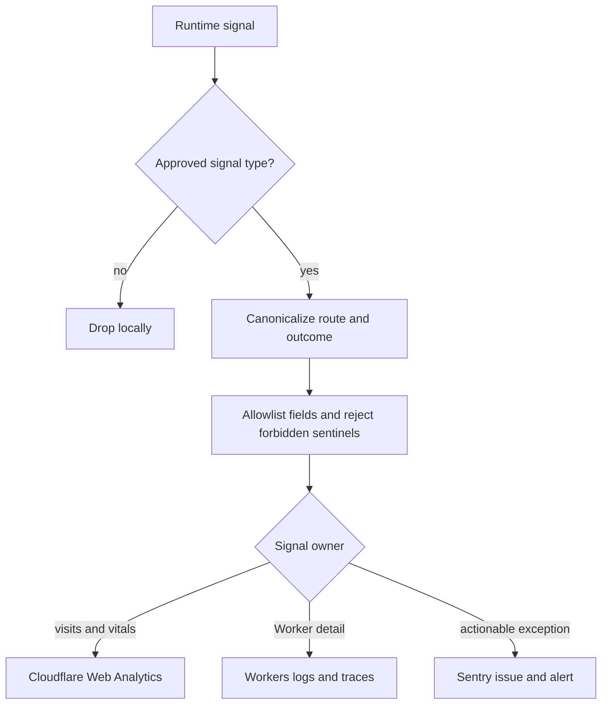
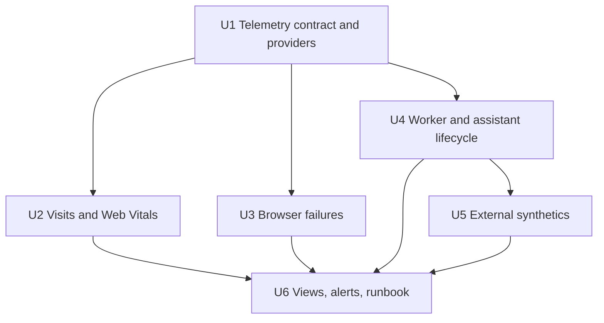

# Site Observability - Plan

## Goal Capsule

- **Objective:** Make site usage, browser failures, Worker and assistant health, and production availability visible soon enough to detect and diagnose regressions without collecting visitor identity or chat content.
- **Authority hierarchy:** The confirmed Product Contract in this plan governs scope; the privacy boundaries in `docs/site-assistant.md` govern data collection; current provider documentation governs integration details; repository tests and production telemetry prove delivery.
- **Execution profile:** Deliver the work in dependency order, establish collection before dashboards and alerts, and keep every telemetry path fail-open.
- **Stop conditions:** Stop rather than ship if any provider requires persistent visitor identity, transcript content, replay credentials, raw IP addresses, raw user agents, full URLs, query strings, referrers, request bodies, or DOM/input capture for the required capabilities.
- **Tail ownership:** Implementation owns provider configuration, automated verification, deployment evidence, dashboards, alerts, synthetics, and runbook updates. Manual browser validation remains user-owned.

---

## Product Contract

### Summary

The site will gain a privacy-conscious observability baseline spanning visits, page performance, browser exceptions, Worker execution, assistant lifecycle health, dashboards, alerting, and external synthetic checks. Cloudflare remains the operational authority for traffic and Worker execution; Sentry supplies actionable exception grouping and uptime notification. The system must remain anonymous by construction and must never make rendering or chat depend on telemetry delivery.

### Problem Frame

Today the Worker has structured failure logs and D1 stores useful assistant provenance, but browser crashes remain local-console events, visits and page performance are not measured, Worker traces are not explicitly enabled, and there are no agreed dashboards, alert routes, or external canaries. The recent chat-render crash demonstrated the practical consequence: the site could fail for visitors without creating a remotely visible incident.

### Actors

- A1. Visitor — reads canonical pages and may use the assistant without creating an account or analytics identity.
- A2. Operator — reviews aggregate usage, diagnoses incidents, receives alerts, and validates deployments.
- A3. Synthetic monitor — checks public pages and a bounded assistant journey while remaining visibly classified and excluded from human-use metrics.

### Requirements

**Usage and browser health**

- R1. Capture aggregate site visits and per-canonical-page views, including initial loads and completed SPA navigation, without creating a persistent visitor identifier.
- R2. Capture Core Web Vitals and page-load performance by canonical route.
- R3. Remotely capture React render failures, uncaught browser exceptions, and unhandled promise rejections with readable release-mapped stack traces.
- R4. Distinguish root-page render failures, live chat render failures, and replayed-transcript render failures without collecting rendered message content.

**Worker and assistant health**

- R5. Enable Cloudflare Worker traces and preserve structured logs as the detailed server-side authority.
- R6. Correlate browser API operations, Worker events, outbound model calls, and D1 operations with a fresh Worker-generated operation ID that cannot replay a transcript or identify a visitor.
- R7. Record a content-free assistant lifecycle covering admission, reservation, model start, first content, stream completion, persistence, and terminal success, plus distinct expected refusals and failure outcomes.
- R8. Report server durable success, browser terminal observation, and browser render success as separate states; server durable success requires persistence plus terminal emission.
- R9. Measure transcript replay independently, including success, empty replay, timeout, retry, continue-without-history, render success, and render failure.

**Operations**

- R10. Provide operator views for visits, page views, Core Web Vitals, frontend failures, Worker errors and traces, server durable success, client terminal/render success, replay success, time to first content, durable completion latency, and synthetic health.
- R11. Alert on new or regressed frontend/Worker exceptions, consecutive external uptime failures, failed or missed scheduled canaries, and sustained critical assistant failures without relying on noisy low-volume percentages.
- R12. Run external synthetics for the homepage, a nested canonical route, API routing contracts, and a bounded production assistant turn that proves stream completion and durable replay.
- R13. Return a content-free synthetic acknowledgement only after the existing server-held evaluation token validates; the canary must abort without it and synthetic traffic must stay outside human KPI denominators.

**Privacy and reliability**

- R14. Telemetry schemas must allowlist fields and reject chat text, transcript/thread IDs, caller hashes, raw or unknown paths, query strings, hashes, referrers, request headers or bodies, credentials, raw IPs, raw user agents, DOM content, form/input values, and persistent visitor/session identifiers.
- R15. Automatic provider request context remains disabled until exported provider envelopes prove that URLs, headers, cookies, user/IP/user-agent data, bodies, breadcrumbs, contexts, extras, and credentials are absent.
- R16. Telemetry collection must fail open, remain bounded, and never delay rendering, streaming, reservation release, persistence, or terminal responses.
- R17. Sampling, maximum retention, account ownership, least-privilege access, alert content, deletion, offboarding, and token rotation must be set per provider before collection is enabled.
- R18. Local, preview, evaluation, and production signals must be separable, and only production human traffic contributes to site-use dashboards.
- R19. Telemetry errors must use fixed internal outcome codes and safe stack-frame locations; arbitrary exception messages, causes, provider errors, and thrown values must never reach providers or alert titles.
- R20. Production source maps must upload with CI-only credentials to an immutable release, remain absent from public artifacts, and make upload or cleanup failure block release.
- R21. Untrusted traffic must not create unbounded event cardinality, quota exhaustion, or alert storms; expected refusals use bounded counters and fixed fingerprints rather than exception issues.
- R22. The assistant canary must have a documented cadence, monthly model/D1 growth bound, fixed non-sensitive prompt, evaluation-conversation retention policy, and spend/row-growth stop threshold.

### Key Flows

- F1. Anonymous visit measurement
  - **Trigger:** A1 loads a canonical page or completes an SPA navigation.
  - **Steps:** The analytics beacon records the canonical path and browser performance; query/hash-only changes and rerenders do not create page views.
  - **Outcome:** A2 can see site visits, page views, route distribution, and Core Web Vitals without a site-managed visitor identity.
  - **Covered by:** R1, R2, R14-R18
- F2. Browser failure reporting
  - **Trigger:** A1 encounters a root, chat, or transcript-render exception, uncaught error, or rejected promise.
  - **Steps:** The browser SDK applies the field allowlist, adds canonical route/release/render context, and sends the event without replay or PII.
  - **Outcome:** A2 receives a grouped, source-mapped issue while A1 retains the existing recovery experience.
  - **Covered by:** R3, R4, R11, R14-R18
- F3. Assistant operation correlation
  - **Trigger:** A1 replays a transcript or submits a new question.
  - **Steps:** The Worker creates and returns a fresh operation ID; one allowlisted adapter mirrors the existing reservation, streaming, and persistence transitions; terminal success is emitted only after persistence.
  - **Outcome:** A2 can locate the failing layer and stage without reading the conversation or possessing its credential.
  - **Covered by:** R5-R9, R14-R18
- F4. External production canary
  - **Trigger:** The scheduled external workflow or uptime monitor runs.
  - **Steps:** Public page/API contracts are checked; the assistant canary uses the evaluation token, completes one bounded turn, and confirms durable replay.
  - **Outcome:** Failures notify A2 and synthetic traffic remains excluded from human metrics.
  - **Covered by:** R11-R13, R16, R18

### Acceptance Examples

- AE1. **Covers R1, R14.** Given a visitor loads `/work/athena/agent-ready-repository?source=test#section`, when analytics records the view, then the dashboard attributes one view to `/work/athena/agent-ready-repository` and retains neither the query nor hash.
- AE2. **Covers R1.** Given React rerenders on one route, when location is unchanged, then no duplicate page view is emitted; a completed navigation to another canonical route emits one new view.
- AE3. **Covers R3, R4, R14.** Given a stored assistant message crashes during rendering and contains sentinel secret text, when the error is captured, then the issue identifies `replay_render`, route, and release while the sentinel, thread ID, and message text are absent.
- AE4. **Covers R6-R8.** Given a normal assistant turn, when the Worker persists output and emits terminal success, then one operation ID links the application event to its request trace and the browser records terminal observation and render success separately.
- AE5. **Covers R7-R9.** Given provider failure after partial text, empty completion, interrupted stream, superseded reservation, persistence failure, or replay timeout, when telemetry is inspected, then each has a distinct bounded outcome and none is counted as durable success.
- AE6. **Covers R13, R18.** Given the scheduled canary completes a production chat and replay, when dashboards aggregate human use, then the canary is visible in synthetic health but excluded from visit and assistant KPI totals.
- AE7. **Covers R15-R17.** Given Sentry or analytics ingestion is blocked or unavailable, when a visitor loads a page or uses chat, then the user-visible flow is unchanged and no recursive telemetry failure is generated.
- AE8. **Covers R14, R15, R19.** Given credential, URL, header, exception, and stack sentinels cross a chat and replay request, when exported provider envelopes and alert notifications are inspected, then every sentinel is absent and only approved codes and frame locations remain.
- AE9. **Covers R13, R18.** Given an external page synthetic runs, when visit metrics are inspected, then its Web Analytics beacon was never emitted and no post-ingestion filtering claim is required.

### Scope Boundaries

**Included now**

- Anonymous aggregate visits and canonical page views.
- Core Web Vitals, frontend and Worker exceptions, Worker traces, assistant lifecycle/replay health, dashboards, alerts, and external synthetics.
- Content-free assistant/model/corpus/release provenance already present in the runtime.

**Deferred to follow-up work**

- Read-only agent or MCP access to observability data.
- Automated incident diagnosis or remediation.
- Answer-quality scoring and evaluation dashboards.
- Additional paid uptime regions or monitors if the initial provider entitlement is insufficient.

**Outside this product's identity**

- Persistent visitor identity, cross-device identity, cookies or fingerprinting for analytics, advertising profiles, behavioral funnels, session replay, DOM/input capture, transcript inspection, prompt/completion telemetry, or automated actions against visitors or conversations.

---

## Planning Contract

### Key Technical Decisions

- KTD1. **Cloudflare Web Analytics owns visits and Core Web Vitals.** (session-settled: user-approved — chosen over deriving usage from sampled error-monitor transactions: the plan must capture site and page visits at minimum.) Activate collection only after the router resolves an allowlisted canonical route. Verify whether automatic SPA reporting can preserve that boundary; otherwise disable it and use only a provider-supported canonical page-view mechanism. The plan does not introduce a custom visit table or broaden `run_worker_first` to static assets.
- KTD2. **Sentry owns actionable exceptions and the primary external uptime monitor.** (session-settled: user-approved — chosen over local-console-only errors and a single all-purpose analytics store: dedicated monitoring is needed while Cloudflare remains the Worker authority.) Use integration allowlists and a final `beforeSend` scrubber for issue capture only. Disable replay, profiling, product analytics, default PII, logs, performance tracing, and automatic request context. Upload hidden browser source maps privately during the production build, then remove them from deployable artifacts.
- KTD3. **Cloudflare remains authoritative for safe Worker logs and traces.** Explicitly enable bounded trace sampling only after exported envelopes from credential-bearing endpoints prove the platform subset is safe. Retain allowlisted structured application logs and saved queries. Disable native invocation fields or request tracing that exposes forbidden request metadata.
- KTD4. **Correlation uses Worker-generated ephemeral operation IDs, not identities.** Create a new authoritative ID per chat turn or transcript replay and return it through a response header or SSE metadata. Emit it in one application event inside the Cloudflare request trace and tag sanitized Sentry issues with it. Use the native request trace to traverse automatic child spans; do not require custom IDs on every span or use them as metric labels.
- KTD5. **The existing lifecycle remains authoritative.** Instrument `finalizeAssistantStream`, reservation, replay, and persistence transitions rather than creating a parallel observability state machine. Define `server_durable_success` as persistence committed plus terminal success emitted. Define `client_terminal_observed` and `client_render_success` as separate browser evidence rather than server truth.
- KTD6. **No observability data is added to chat D1.** Cloudflare and Sentry provide independent sinks that remain available when D1 fails. Existing D1 provenance can support content-free investigation, but no new visit/error tables or joinable identifiers are introduced.
- KTD7. **Synthetics have two layers plus missed-run detection.** A Sentry uptime monitor checks public availability; a scheduled GitHub Actions workflow runs deeper page/API/chat-and-replay checks from outside Cloudflare; an external Cron Monitor or equivalent heartbeat alerts when that schedule never runs. Page checks use content-validating HTTP requests that do not execute the analytics beacon. The assistant canary requires a server acknowledgement of `source=evaluation` plus `run_kind=synthetic` after evaluation-token validation.
- KTD8. **Low-traffic alerting starts with absolutes and consecutive failures.** New/regressed issues, any critical misconfiguration/persistence failure, and consecutive synthetic failures alert immediately or after a short confirmation window. Rate- and percentile-based thresholds remain dashboard-only until a measured baseline supports them.
- KTD9. **One Worker adapter owns observability fan-out.** Reservation, replay, model, persistence, and failure boundaries emit fixed events through one allowlisted adapter. The adapter writes structured Cloudflare application logs and forwards only approved actionable exceptions to Sentry.
- KTD10. **Errors are codes, not arbitrary strings.** Provider errors, exception messages, causes, non-`Error` values, and stack first lines are untrusted. Telemetry retains only a fixed internal code, bounded stage, release, approved dimensions, and sanitized stack frame locations.
- KTD11. **Provider readiness precedes code enablement.** Record site/project identifiers, production hostname, release scheme, retention, quotas, trace sampling, owners, alert destinations, escalation, GitHub environment, and missed-run entitlement before collection starts. Keep Sentry upload credentials CI-only and alerts disabled until collection passes its gates.
- KTD12. **The deep canary may create only bounded evaluation transcripts.** Use a fresh thread and fixed non-sensitive prompt at conservative cadence. Review or remove evaluation conversations under the documented retention policy; do not add a privileged cleanup endpoint for observability.

### High-Level Technical Design

The diagrams are directional design guidance, not implementation specification.

### Signal Definitions

- **Site visit:** Cloudflare Web Analytics' privacy-preserving visit metric. It is an aggregate provider metric, not a site-managed unique-person count.
- **Page view:** One received beacon for a canonical initial page or completed SPA route navigation.
- **Frontend availability failure:** Root/chat/replay render failure, uncaught exception, or unhandled rejection after configured noise filtering.
- **Admitted assistant turn:** A valid turn that passed request and concurrency admission and acquired a reservation.
- **Server durable success:** An admitted turn whose assistant output was persisted and whose terminal success was emitted by the Worker.
- **Client terminal observed:** The browser received and processed terminal success for the operation.
- **Client render success:** The browser rendered the resulting assistant content without a local boundary failure.
- **Replay success:** A transcript request that loaded, applied messages, and completed render without timeout or exception.

### Data and Privacy Contract

- Bounded dimensions: canonical route, environment, source (`site`, `evaluation`), run kind (`human`, `synthetic`), release/Worker version, assistant/corpus/model version, lifecycle stage, outcome code, status class, duration, Web Vital name/value/rating, render context, and ephemeral operation ID for search only.
- Forbidden data is the full R14 list. Sanitizers operate before SDK transport and structured logging; provider-side scrubbing is defense in depth.
- Sentry projects use an integration allowlist and `beforeSend` removal of request, user, URL, header, cookie, context, extra, breadcrumb, and untrusted exception values. Cloudflare Web Analytics receives no custom visitor identifier or unapproved route.
- Maximum provider retention, member roles, MFA posture, alert payloads, source-map access, deletion, offboarding, and token rotation are release prerequisites. No repository-managed raw telemetry store is created.

### Rollout Strategy

**Pre-deploy gate**

1. Satisfy KTD11 and record the prior Cloudflare version plus rollback command. Confirm the release contains no unexpected D1 migration.
2. Run the Verification Contract, privacy sentinels, source-map upload/cleanup audit, `bunx wrangler deploy --dry-run`, and fail-open transport tests. Keep alerts, native request context, and traces disabled.

**Deploy collection**

3. Use `bun run deploy` so the repository's migration-first invariant remains intact even though this plan should add no migration.
4. Verify the deployment hostname first and the custom domain through a documented propagation window. Require stable page markers, nested route, API 404, release identity, and static/API convergence.
5. Export real provider envelopes from credential-bearing sentinel requests. Enable only the proven-safe Cloudflare trace/request subset. Confirm one controlled Sentry issue resolves through its private source map.

**Go or rollback**

6. Go only when user flows are unchanged, no forbidden sentinel appears, lifecycle fields remain bounded, the evaluation-token acknowledgement is proven, both hostnames agree, and production exception volume remains stable through the observation window.
7. Stop immediately for a privacy leak, public source map, recursive telemetry failure, startup/chat semantic regression, unexplained hostname divergence, or unbounded provider volume. Disable safe provider ingestion, then roll Worker and assets back together to the recorded version. Do not reverse D1 migrations.

**Baseline and alert enablement**

8. Save absolute-event dashboards immediately. Review a 14-day baseline before enabling any rate/percentile alert, and require a documented minimum eligible-event count; otherwise keep absolute/consecutive alerting.
9. Configure uptime and missed-run monitoring, then exercise provider test notifications, a disposable failing monitor, and a controlled failed manual canary. Capture creation, delivery, acknowledgement, recovery, and monitor-health evidence without breaking the production homepage.
10. Document steady-state investigation, provider outage behavior, bounded canary accumulation, access review, rollback, token rotation, and destructive-removal ordering. A future removal deletes writers and verifies propagation before deleting provider/storage configuration.

### Assumptions

- The Cloudflare zone supports Web Analytics and the account can create its beacon token.
- The selected Sentry account supports separate browser and Worker projects plus at least one uptime monitor; additional paid monitors are not required for the initial design.
- GitHub Actions is available for scheduled/manual workflows and can hold `CHAT_EVALUATION_TOKEN` plus any Sentry release-upload secret.
- The selected monitoring entitlement can alert when the scheduled deep canary does not check in; otherwise an equivalent external dead-man switch is required before enablement.
- Provider configuration performed in dashboards will be captured as named operational steps and screenshots/links in the delivery evidence, because not every setting is repository-managed.

### External Research Decisions

- Cloudflare Web Analytics is privacy-first, records page views and visitor-facing performance, supports SPA route-change reporting, does not log query strings, and retains unsampled received beacon data for seven days before longer-term aggregation. See [Cloudflare Web Analytics overview](https://developers.cloudflare.com/web-analytics/about/), [data collection](https://developers.cloudflare.com/web-analytics/data-metrics/data-origin-and-collection/), and [FAQ](https://developers.cloudflare.com/web-analytics/faq/).
- Workers traces must be enabled explicitly for the current compatibility date; automatic instrumentation covers fetch calls, bindings, and handlers, while logs retain structured JSON and can be queried and visualized. See [Workers tracing](https://developers.cloudflare.com/workers/observability/traces/), [Workers Logs](https://developers.cloudflare.com/workers/observability/logs/workers-logs/), and [Query Builder](https://developers.cloudflare.com/workers/observability/query-builder/).
- Sentry provides dedicated React and Cloudflare SDKs, source-map support, issue alerting, and uptime monitoring. The plan intentionally declines its replay, tracing, and log products to keep ownership and privacy boundaries narrow. See [Sentry JavaScript SDKs](https://github.com/getsentry/sentry-javascript), [Sentry for Cloudflare](https://docs.sentry.dev/platforms/javascript/guides/cloudflare/), and [Sentry Monitors and Alerts](https://sentry.io/changelog/monitors--alerts--now-generally-available/).

---

## Implementation Units

### U1. Establish the telemetry contract and provider foundation

- **Goal:** Create explicit browser and Worker adapters that expose only approved signals and configure provider/release boundaries before feature instrumentation begins.
- **Requirements:** R14-R21; KTD2-KTD4, KTD6, KTD9-KTD11
- **Files:** `package.json`, `bun.lockb`, `.env.example`, `.dev.vars.example`, `vite.config.js`, `wrangler.jsonc`, `src/observability/`, `worker/observability.js`, `worker/observability.test.js`
- **Approach:** Add pinned Sentry React/Cloudflare and source-map tooling; create environment-aware initialization, field allowlists, canonical-route helpers, Worker-generated operation IDs, safe event adapters, release metadata, and private source-map upload. Use integration allowlists plus final transport scrubbers. Keep automatic request context disabled and make missing/blocked telemetry a no-op outside production.
- **Patterns:** Follow exported pure helpers and injected transports/clocks used by current chat tests. Keep browser-only code out of the initial critical path where lazy initialization does not sacrifice early exception capture; record the measured bundle consequence.
- **Test scenarios:**
  - Approved bounded fields survive browser and Worker sanitization.
  - Sentinel chat content, thread IDs, caller hashes, headers, bodies, full URLs, query/hash/referrer values, IPs, user agents, DOM/input content, and credentials are rejected or removed.
  - Unknown route values become a bounded `unrecognized` classification and never appear raw.
  - Reused or malformed client correlation values cannot choose the authoritative operation ID or create high-cardinality dimensions.
  - Repeated expected refusals and identical attacker-triggered failures preserve bounded fingerprints, event volume, and genuine-server-error delivery.
  - Missing provider configuration and simulated transport failure do not change application/Worker outcomes or recursively report themselves.
  - Production source maps upload against the immutable release and are absent from public build artifacts; upload or cleanup failure blocks release, while local builds require no monitoring credentials.
  - CI logs, build manifests, Worker bundles, maps, and deployed assets contain no upload credential or secret sentinel.
- **Verification:** Unit coverage proves the privacy schema and failure behavior; production build output records initial/lazy chunk changes and source-map handling.

### U2. Add authoritative visits and Core Web Vitals

- **Goal:** Populate Cloudflare Web Analytics with site visits, canonical page views, route distribution, and Core Web Vitals.
- **Requirements:** R1, R2, R10, R14-R18; KTD1
- **Files:** `index.html`, `src/main.jsx`, `src/routes.js`, `src/observability/analytics.js`, `src/observability/analytics.test.js`, `.env.example`, `docs/observability.md`
- **Approach:** Load the Cloudflare beacon only for the production hostname after `ROUTE_PATHS` and `normalisePath` resolve a canonical route. Verify automatic SPA navigation against that allowlist; if it cannot enforce the boundary, use only a supported canonical page-view mechanism or stop under the Goal Capsule. Do not proxy static pages through Worker code or add a custom analytics endpoint/store.
- **Test scenarios:**
  - Initial load and completed canonical SPA navigation are eligible for one page view each.
  - React rerenders and query/hash-only changes do not create duplicate page views.
  - Trailing-slash and legacy redirects resolve to the canonical route dimension.
  - Unknown paths, local development, preview/evaluation traffic, and missing beacon configuration do not emit production analytics.
  - Repeated external HTTP synthetics do not execute the beacon or increase Web Analytics counts.
  - Blocking the analytics script leaves navigation, rendering, and chat unchanged.
  - Provider verification shows site visits, per-page views, and Core Web Vitals without query strings or custom visitor identifiers.
- **Verification:** Focused analytics tests plus a production dashboard canary for the homepage and one nested route.

### U3. Capture actionable browser and render failures

- **Goal:** Turn root/chat/replay browser failures into scrubbed, grouped, source-mapped Sentry issues without changing recovery UX.
- **Requirements:** R3, R4, R10, R11, R14-R21; KTD2, KTD10
- **Files:** `src/main.jsx`, `src/error-page.jsx`, `src/chat/chat-panel.jsx`, `src/chat/chat-transcript.js`, `src/observability/browser.js`, `src/observability/browser.test.js`, `vite.config.js`
- **Approach:** Initialize a minimal allowlisted Sentry client before React mounts; use the existing error page for explicit route/render context and a chat-local boundary for `live_render` versus `replay_render`. Deduplicate boundary and global capture. Replace untrusted exception values with fixed codes before transport and attach only canonical route, release, render context, safe fingerprint, and sanitized frame locations.
- **Test scenarios:**
  - Root render, live chat render, replay render, uncaught exception, and unhandled rejection each create one issue event with the correct bounded context.
  - The same exception observed by a boundary and global handler is not reported twice.
  - Replaying a stored message containing sentinel content reports the failure without message text or thread ID.
  - Error messages, nested causes, non-`Error` throws, and stack first lines containing sentinel content never reach event JSON, issue titles, or alerts.
  - Expected API refusals and user cancellation do not become frontend availability issues.
  - Source-mapped production events resolve to repository source while public assets do not expose maps.
  - Sentry transport failure leaves the existing recovery page, retry, and chat behavior intact.
- **Verification:** Browser-adapter tests with a fake Sentry transport, focused component coverage, build/source-map proof, and a scrubbed production test issue. Manual browser validation is left to the user.

### U4. Instrument Worker traces and the durable assistant lifecycle

- **Goal:** Make Worker, Anthropic, D1, transcript replay, and assistant lifecycle failures diagnosable and alertable while preserving streaming and persistence semantics.
- **Requirements:** R5-R11, R13-R21; KTD2-KTD6, KTD8-KTD10
- **Files:** `wrangler.jsonc`, `worker/index.js`, `worker/index.test.js`, `worker/observability.js`, `worker/observability.test.js`, `src/chat/chat-panel.jsx`, `src/chat/chat-transcript.js`, `docs/site-assistant.md`
- **Approach:** Route current free-form JSON calls through one allowlisted Worker adapter. Generate and return authoritative operation IDs. Time admission, replay, reservation/D1 work, model start, first content, stream completion, persistence, server terminal emission, browser terminal observation, and render success. Enable only a proven-safe sampled Cloudflare trace subset. Use Sentry Cloudflare capture only for sanitized actionable exceptions and mirror, never replace, current state transitions.
- **Test scenarios:**
  - A successful turn returns one operation ID, records it in a Worker application event and Sentry issue context, and uses the enclosing Cloudflare request trace to reach Anthropic/D1 child spans without exposing a thread ID.
  - Admission rejection, rate limiting, provider `RUN_ERROR` after partial text, empty completion, disconnect/interruption, superseded reservation, persistence failure, and unhandled exception produce distinct bounded outcomes.
  - `server_durable_success`, `client_terminal_observed`, and `client_render_success` remain independent; ownership releases correctly on every failure.
  - Transcript replay success, empty, timeout, retry, continue-without-history, and render completion have distinct lifecycle evidence.
  - Synthetic `run_kind` is accepted only after server-held evaluation-token validation; public classification attempts are ignored.
  - Logs/issues contain no chat text, provider message/request ID, request body/header, transcript credential, raw path, IP, or user agent.
  - Streaming and persistence exceptions raised after a Response exists still produce a bounded lifecycle failure through the adapter.
  - Exported Cloudflare and Sentry envelopes from sentinel chat/replay requests contain none of the forbidden request metadata or untrusted error text.
  - Disabling Cloudflare/Sentry ingestion does not change response codes, SSE delivery, persistence, or cleanup.
- **Verification:** Expanded Worker unit/migration-backed integration tests, structured-log snapshots, Cloudflare trace canary, and one bounded production turn inspected without content.

### U5. Add external uptime and production canaries

- **Goal:** Detect DNS/edge/static-route/API/chat regressions independently of the deployed Worker and keep synthetic traffic isolated.
- **Requirements:** R11-R13, R16, R18, R21, R22; KTD7, KTD8, KTD11, KTD12
- **Files:** `scripts/production-smoke.mjs`, `scripts/production-smoke.test.js`, `.github/workflows/production-observability.yml`, `.github/workflows/README.md`, `package.json`, `docs/observability.md`
- **Approach:** Configure the Sentry uptime monitor for the canonical homepage. Add a scheduled and manually dispatchable GitHub workflow that performs content-validating HTTP page checks, unknown API routing, malformed transcript rejection, and a bounded assistant evaluation turn followed by transcript replay. Pin the exact production origin, use manual redirect handling for credential-bearing requests, never log request details, and run the paid model canary at a conservative cadence.
- **Test scenarios:**
  - Homepage and nested route checks fail on non-success, wrong content type, or missing stable page marker.
  - Unknown API and malformed transcript requests retain their expected safe contracts.
  - The assistant canary completes the stream, receives terminal success, and replays the durable turn without asserting response prose.
  - Missing/invalid evaluation secret fails the canary clearly without falling back to human classification.
  - The canary aborts unless the Worker returns the token-authorized synthetic acknowledgement.
  - Cross-origin or unexpected redirects stop before resending the evaluation token; verbose fetch failures and artifacts never expose it.
  - Synthetic events appear in synthetic views and are absent from human visit/chat KPIs.
  - A delayed, disabled, or never-started schedule crosses the external lateness tolerance and alerts.
  - Monthly model spend and evaluation-row growth remain below the documented stop thresholds.
  - One forced failure and subsequent recovery exercise the notification route and clear the incident.
- **Verification:** Unit tests for the smoke client, manual workflow dispatch against production, scheduled-run evidence, Sentry uptime incident/recovery evidence, and bounded Anthropic cost recorded in the runbook.

### U6. Build the operator views, alerts, and runbook

- **Goal:** Turn collected signals into a small, durable operating system for detection, diagnosis, and rollback.
- **Requirements:** R10, R11, R14-R22; KTD1-KTD3, KTD8-KTD12
- **Files:** `docs/observability.md`, `docs/site-assistant.md`, `README.md`
- **Approach:** Define the dashboard map across Cloudflare Web Analytics, Workers Observability, and Sentry; save named Worker queries/visualizations; configure issue and uptime alerts; document owners, access roles, retention/sampling, generic alert payloads, signal definitions, exclusions, investigation paths, provider outage behavior, token rotation, rollout, and removal ordering. Do not create a transcript analytics dashboard.
- **Test scenarios:**
  - Every R10 signal has one named source/view and every R11 alert has an owner, trigger, recovery rule, and tested delivery route.
  - Dashboard filters exclude local/evaluation/synthetic traffic from human KPIs and separate expected refusals from availability failures.
  - A browser issue can be followed from Sentry to a release/source line; a chat issue can be followed by operation ID into Cloudflare logs/traces without transcript access.
  - A non-operator cannot access events or source maps, and delivered alerts contain only generic incident metadata plus authenticated links.
  - Low-traffic periods do not create percentage-only alert noise; critical absolute events and consecutive synthetics still alert.
  - Runbook rollback disables collection safely without changing site/chat availability, and destructive removal follows writer-first/provider-or-storage-last ordering.
- **Verification:** Operator checklist review plus captured links/screenshots or exported definitions for every dashboard, saved query, monitor, and tested alert route.

### Unit Dependencies

---

## Verification Contract

| Gate | Applies to | Proof |
|---|---|---|
| `bun test` | U1-U5 | All unit, component, Worker, migration-harness, privacy-sentinel, and smoke-client scenarios pass. |
| `bun run build` | U1-U4 | Production assets build, source-map upload behavior is correct, and bundle-size deltas are recorded. |
| `bun run build:ci` | U1-U5 | Production build and migration compatibility remain green. |
| Migration audit | U1-U6 | No unexpected D1 migration is present locally or remotely; deploy still uses the repository's migration-first command. |
| Provider canaries | U2-U6 | Cloudflare receives visits/vitals and Worker traces; Sentry receives scrubbed browser/Worker issues and uptime transitions. |
| Production synthetic | U4-U6 | Homepage, nested page, API contracts, bounded chat, and durable replay pass from the external workflow. |
| Provider-envelope privacy audit | All | Exported raw Cloudflare/Sentry envelopes and alerts from credential-bearing sentinel requests contain no R14 or R19 data. |
| Release artifact audit | U1, U3 | Source maps uploaded to the immutable release are absent from public assets; CI logs, manifests, bundles, and maps contain no credentials or secret sentinels. |
| Alert drill | U5-U6 | Each configured notification fires on a controlled failure and resolves on recovery; a missed canary check-in also creates an incident. |

### Verification Notes

- Provider dashboards are mutable external configuration. Delivery evidence must name the account/project/site, view or monitor, configuration owner, and verification timestamp without copying secrets into the repository.
- Automated provider and synthetic checks are implementation-owned. Visual/manual browser validation remains user-owned.
- Production evidence must inspect both the Worker deployment hostname and custom domain when propagation could differ.
- Rollout is no-go until retention/access settings are recorded, raw provider envelopes pass the sentinel audit, source maps are absent from deployed assets, and telemetry failure has proven fail-open behavior.

---

## Definition of Done

- Cloudflare Web Analytics shows site visits, canonical page views, and Core Web Vitals for production traffic.
- Browser root/chat/replay failures create one scrubbed, source-mapped Sentry issue with release and canonical route context.
- Worker logs are structured, traces are explicitly enabled, and actionable Worker failures reach Sentry without transferring log authority.
- One Worker-generated operation ID correlates a chat/replay operation with its Worker application event, request trace, and sanitized Sentry issue without becoming an identity or metric dimension.
- Assistant lifecycle and replay views distinguish admission, first content, stream, persistence, server durable success, browser terminal observation, render success, expected refusals, and required failures.
- Sentry uptime plus the scheduled external canary cover public availability, nested routing, API contracts, bounded chat, and durable replay.
- An external dead-man switch detects a scheduled deep canary that is delayed, disabled, or never starts.
- Human-use dashboards exclude local, evaluation, and synthetic traffic; no transcript inspection surface is introduced.
- Sampling, maximum retention, access ownership, alert routing/content, incident investigation, token rotation, deletion/offboarding, rollout, rollback, and safe removal are documented in `docs/observability.md` and `docs/site-assistant.md`.
- Privacy sentinel tests and raw provider-envelope inspection prove that forbidden R14 and R19 data never reaches telemetry sinks or notifications.
- Production source maps are private, release-matched, and absent from deployed assets; upload credentials appear only in CI secrets.
- Canary cadence, prompt, evaluation-row retention, monthly model/D1 growth, and spend/row stop thresholds are documented and reviewed without adding a privileged cleanup endpoint.
- Telemetry-provider failure has no user-visible effect on navigation, rendering, chat streaming, persistence, or recovery.
- Untrusted IDs, expected refusals, and repeated identical failures cannot create unbounded dimensions, exception issues, quota use, or alert storms.
- All Verification Contract gates pass; manual browser validation is explicitly left to the user.
